# AWS LAMP Stack Deployment on Ubuntu Linux
**A step-by-step LAMP stack deployment to host a WordPress website on AWS EC2 using Ubuntu, Apache, MariaDB, and PHP.**

---

<p align="center">
  
</p>

<p align="center">
  
  
  
</p>

<p align="center">
  
  
  
</p>

## Table of Contents

1. [🎯 Objectives](#-objectives)
2. [Traffic Flow](#traffic-flow)
3. [Architecture](#architecture)
4. [Prerequisites](#prerequisites)
5. [Step 1 — Create EC2 Instance](#step-1--create-ec2-instance)
6. [Step 2 — Connect to EC2](#step-2--connect-to-ec2)
7. [Step 3 — Update Packages](#step-3--update-packages)
8. [Step 4 — Install Apache](#step-4--install-apache)
9. [Step 5 — Install PHP](#step-5--install-php)
10. [Step 6 — Install MariaDB](#step-6--install-mariadb)
11. [Step 7 — Create Database + User](#step-7--create-database--user)
12. [Step 8 — Test DB Connection (PHP)](#step-8--test-db-connection-php)
13. [Step 9 — Install PHP Extensions for WordPress](#step-9--install-php-extensions-for-wordpress)
14. [Step 10 — Download & Deploy WordPress](#step-10--download--deploy-wordpress)
15. [Step 11 — Configure WordPress (wp-config.php)](#step-11--configure-wordpress-wp-configphp)
16. [Step 12 — Point Apache to WordPress](#step-12--point-apache-to-wordpress)
17. [Step 13 — Run WordPress Installer](#step-13--run-wordpress-installer)

---

## 🎯 Objectives
- Deploy **Apache + MariaDB + PHP** on **Ubuntu EC2**
- Host **WordPress** under a proper web root
- Validate **Apache**, **PHP runtime**, and **database connectivity**

---

### Traffic Flow
1. Users access the site via **HTTP (80)** (optional **HTTPS (443)**)
2. **Apache** serves WordPress files from the web root
3. **PHP** executes WordPress code
4. **MariaDB** stores WordPress data locally on the same instance.

## Architecture

**User Browser → EC2 Public IP → Apache (port 80/443) → PHP → MariaDB (localhost:3306) → WordPress files in `/var/www/wordpress` (Apache `DocumentRoot` points here)**

---

### Architecture Diagram (ASCII)
```plaintext
                +-------------------------+
                |      Internet Users     |
                +-----------+-------------+
                            |
                            |  HTTP/HTTPS
                            v
                +-------------------------+
                |    AWS Security Group   |
                |  80, (443), 22 (My IP)  |
                +-----------+-------------+
                            |
                            |
                            v
          +----------------------------------------+
          |       EC2 Instance (Ubuntu 22.04)      |
          |                                        |
          |  +-------------+      +---------------+ |
          |  |   Apache    | --> |      PHP      | |
          |  |   (2.4)     |     |     (8.x)     | |
          |  +------+------+      +-------+-------+ |
          |         |                     |         |
          |         v                     v         |
          |      WordPress            MariaDB       |
          |                           (10.x)        |
          +----------------------------------------+
```

## Prerequisites

- An AWS account with access to EC2  
- SSH keypair to connect to the instance  
- Ubuntu 24.04 EC2 instance  
- Open inbound ports:
  - **HTTP (80)**
  - **HTTPS (443)**
  - **SSH (22)** *(restricted to your IP only)*

---

## Step 1 — Create EC2 Instance

1. Launch an **Ubuntu 24.04** EC2 instance.
2. Choose an instance type `As you like`.
3. Configure a **Security Group** with inbound rules:

| Type | Port | Source |
|------|------|--------|
| SSH  | 22   | Your IP only |
| HTTP | 80   | 0.0.0.0/0 |
| HTTPS| 443  | 0.0.0.0/0 |

✅ **Verify:** Instance is running and you have its **Public IPv4 address**.

<details> 
<summary>📸 <b>Click to view screenshot</b></summary>
<br>
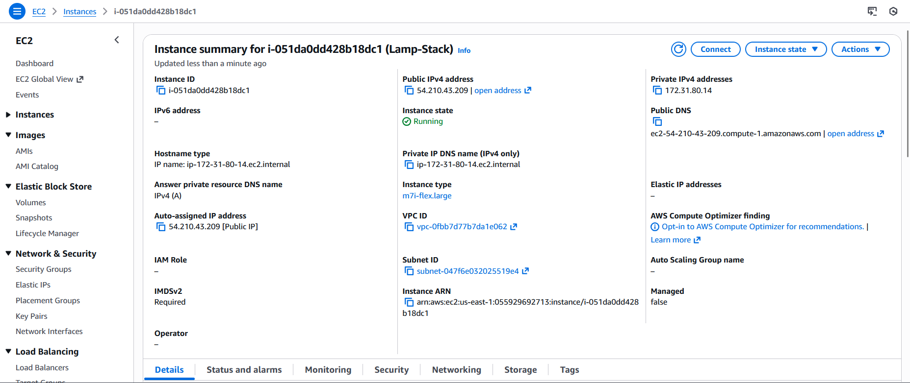 
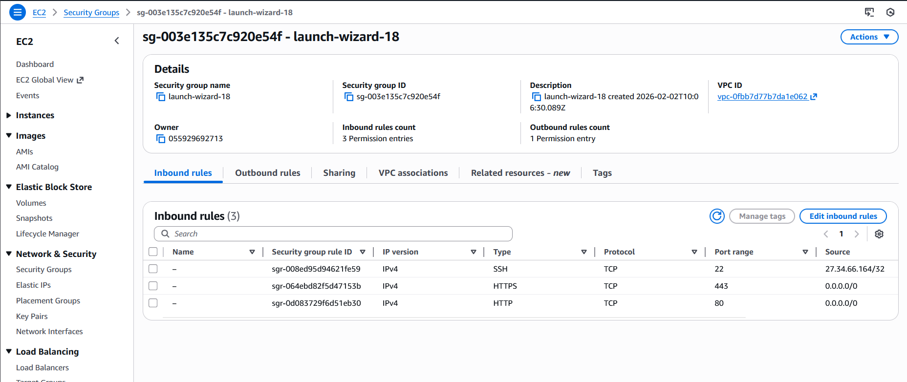
</details>

---

## Step 2 — Connect to EC2

From your local machine:

```bash
ssh -i /path/to/your-key.pem ubuntu@<EC2_PUBLIC_IP>
```
✅ Verify: You land on the EC2 shell as ubuntu@...

---

## Step 3 — Update Packages

```bash
sudo apt update -y
```
✅ Verify: “All packages are up to date.” or updates complete.

---

## Step 4 — Install Apache

```bash
sudo apt install apache2 -y
sudo systemctl enable --now apache2
```
✅ Verify (Browser): Open:

```text
http://<EC2_PUBLIC_IP>/
```
You should see the Apache2 Default Page (“It works!”).

<details> 
<summary>📸 <b>Click to view screenshot</b></summary>
<br>
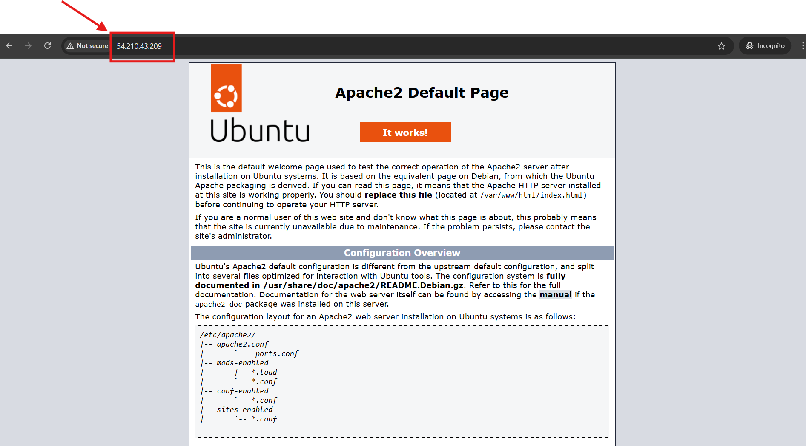
</details>

---

## Step 5 — Install PHP

Install PHP + Apache integration + MySQL driver:

```bash
sudo apt install php libapache2-mod-php php-mysql -y
php -v
```
🤔 Why?
- We install libapache2-mod-php to create a bridge between Apache and PHP. Without this, Apache would just download PHP files as text instead of executing them as code.
  
✅ Verify: php -v prints PHP version (example: PHP 8.3.6)

<details> 
<summary>📸 <b>Click to view screenshot</b></summary>
<br>
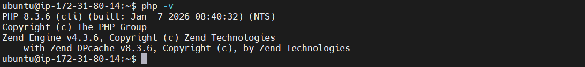
</details>

---

Create `info.php` to verify PHP in browser

```bash
sudo nano /var/www/html/info.php
```

Paste:
```php
<?php
phpinfo();
```

Restart Apache:
```bash
sudo systemctl restart apache2
```

✅ Verify (Browser):
```text
http://<EC2_PUBLIC_IP>/info.php
```
You should see the PHP info page confirming PHP runs via Apache.
- After verification, you can remove `info.php` later for security.

<details> 
<summary>📸 <b>Click to view screenshot</b></summary>
<br>
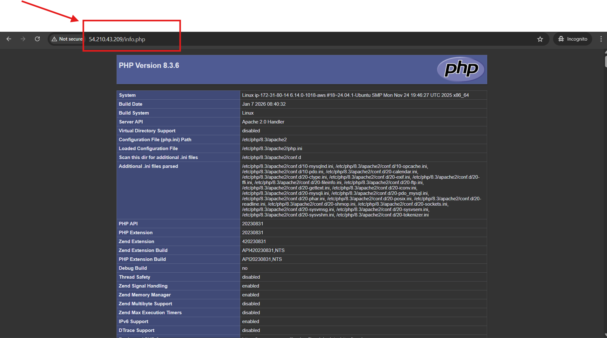
</details>

---

## Step 6 — Install MariaDB

```bash
sudo apt install mariadb-server -y
sudo systemctl enable --now mariadb
sudo systemctl status mariadb
```
✅ Verify: status shows active (running) and MariaDB is ready for connections.

<details> 
<summary>📸 <b>Click to view screenshot</b></summary>
<br>
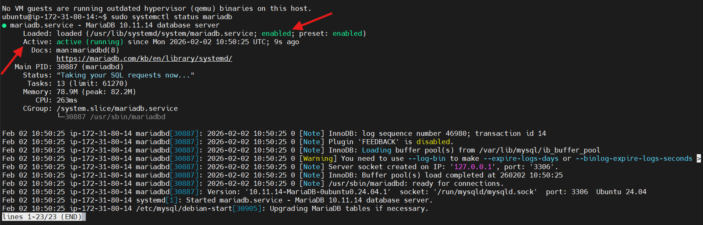
</details>

### Secure Mariadb(`mysql_secure_installation`)

Run the security wizard:
```bash
sudo mysql_secure_installation
```
- This command runs a security setup wizard that hardens MariaDB by removing insecure defaults

| Prompt (Question) | Recommended Answer |
|------------------|-------------------|
| `Switch to unix_socket authentication [Y/n]` | `n` |
| `Change the root password? [Y/n]` | `n` |
| `Remove anonymous users? [Y/n]` | `Y` |
| `Disallow root login remotely? [Y/n]` | `Y` |
| `Remove test database and access to it? [Y/n]` | `Y` |
| `Reload privilege tables now? [Y/n]` | `Y` |

✅ Verify: The wizard finishes successfully and prints completion messages.

---

## Step 7 — Create Database + User

Enter MariaDB shell:
```bash
sudo mysql
```
Create DB + user (replace password with your own):
- DB --> `testdb` in this example.
- DB user --> `test` in this example
- `You may replace with your own`
  
```sql
CREATE DATABASE wordpress_db;

CREATE USER 'wordpress_user'@'localhost' IDENTIFIED BY 'CHANGE_THIS_PASSWORD';

GRANT ALL PRIVILEGES ON wordpress_db.* TO 'wordpress_user'@'localhost';

FLUSH PRIVILEGES;

EXIT;
```
Verify user login
```bash
mysql -u wordpress_user -p
```

Then run:
```sql
SHOW DATABASES;
EXIT;
```
✅ Verify: You can see your database listed.

<details> 
<summary>📸 <b>Click to view screenshot</b></summary>
<br>
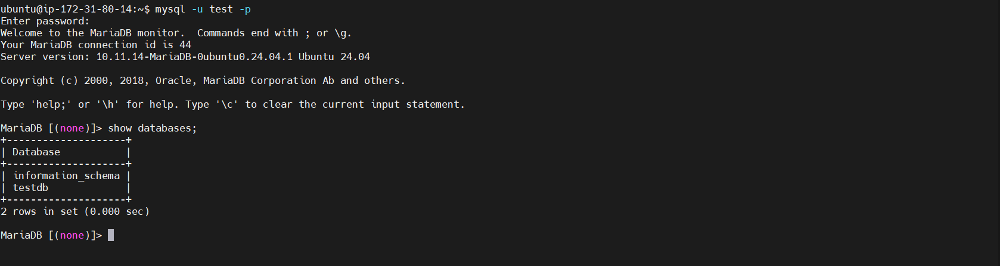
</details>

---

## Step 8 — Test DB Connection (PHP)

Create a database connection test file:
```bash
sudo nano /var/www/html/dbtest.php
```
Paste:
```php
<?php
$servername = "localhost"; 
$username = "wordpress_user_you_made";
$password = "CHANGE_THIS_PASSWORD";
$dbname = "wordpress_db";

$conn = new mysqli($servername, $username, $password, $dbname);

if ($conn->connect_error) {
    die("Connection failed: " . $conn->connect_error);
}

echo "Connected successfully to MariaDB!";
```

✅ Verify (Browser):

`http://<EC2_PUBLIC_IP>/dbtest.php`

You should see:
- `Connected successfully to MariaDB!`

<details> 
<summary>📸 <b>Click to view screenshot</b></summary>
<br>
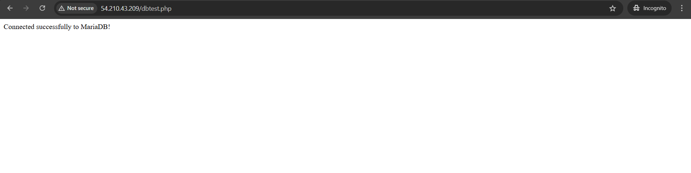
</details>

### Now, Clean up test files

Remove test files after verification:
```bash
sudo rm /var/www/html/dbtest.php
sudo rm /var/www/html/info.php
```
Why to remove them??

- `Security`: Test files like phpinfo() reveal server configuration that attackers can exploit.
- `Cleanliness`: Removing temporary files keeps the web root organized and production-ready.
- `Prevent Accidental Access`: Test files may expose debug info or sample data to users.

---

## Step 9 — Install PHP Extensions for WordPress

Install required WordPress PHP extensions:
```bash
sudo apt install php-curl php-mbstring php-gd php-xml php-xmlrpc php-soap php-intl php-zip php-bcmath php-imagick -y
sudo systemctl restart apache2
```
✅ Verify: No errors; Apache restarts successfully.

---

## Step 10 — Download & Deploy WordPress

Go to `/tmp` and download WordPress:
```bash
cd /tmp
curl -O [https://wordpress.org/latest.tar.gz](https://wordpress.org/latest.tar.gz)
tar -xvzf latest.tar.gz
```
<details> 
<summary>📸 <b>Click to view screenshot</b></summary>
<br>
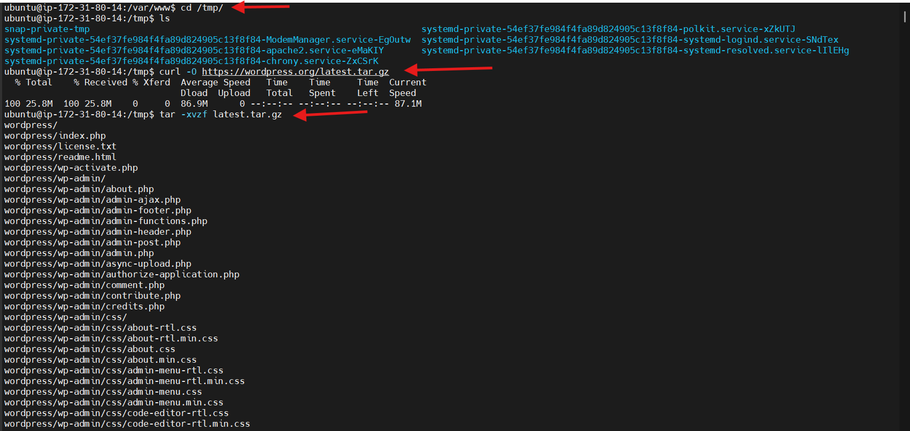
</details>

Move WordPress to /var/www:
```bash
sudo mv wordpress /var/www/
```
Remove Apache default index:
```bash
sudo rm /var/www/html/index.html
```
✅ Verify: WordPress files exist:
```bash
ls /var/www/wordpress
```
You should see folders like:

- `wp-admin`
- `wp-content`
- `wp-includes`

---

## Step 11 — Configure WordPress (`wp-config.php`)

Copy sample config file:
```bash
sudo cp /var/www/wordpress/wp-config-sample.php /var/www/wordpress/wp-config.php
```
🤔 Why? 
- WordPress doesn't come with a `wp-config.php` file by default; it only provides a sample. We copy the sample to create the real configuration file where we will store our database credentials.

Edit config:

```bash
sudo nano /var/www/wordpress/wp-config.php
```
Update these fields:
```php
define( 'DB_NAME', 'wordpress_db' );
define( 'DB_USER', 'wordpress_user' );
define( 'DB_PASSWORD', 'CHANGE_THIS_PASSWORD' );
define( 'DB_HOST', 'localhost' );
```
✅ Verify: DB constants are updated correctly.

---

## Step 12 — Point Apache to WordPress

Edit default Apache vhost:
```bash
sudo nano /etc/apache2/sites-available/000-default.conf
```

Find DocumentRoot and set it to:
```apache
DocumentRoot /var/www/wordpress
```
🤔 Why?
- By default, Apache looks in `/var/www/html`. Since we moved WordPress to `/var/www/wordpress`, we must update this path. If we skipped this, visiting your IP would show a "404 Not Found" or the default Apache page instead of your site.

Restart Apache:
```bash
sudo systemctl restart apache2
```
✅ Verify: No restart errors.

---

## Step 13 — Run WordPress Installer

Open:
```text
http://<EC2_PUBLIC_IP>/wp-admin/
```

Fill:

* Site title
* Admin username
* Admin password
* Admin email

<details> 
<summary>📸 <b>Click to view screenshot</b></summary>
<br>
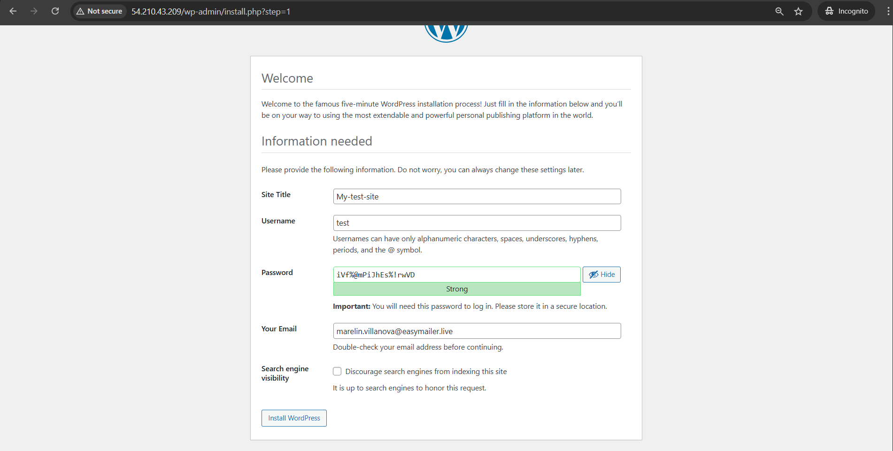
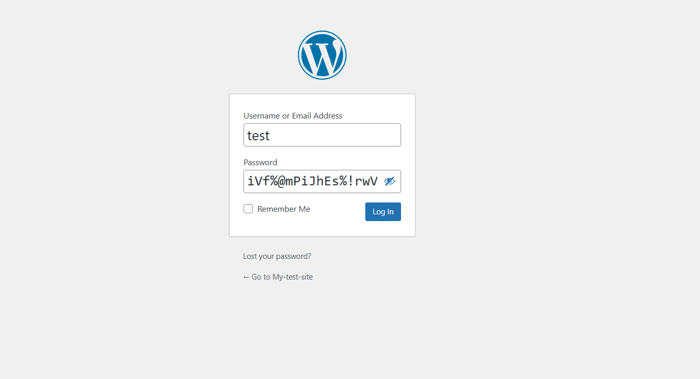 
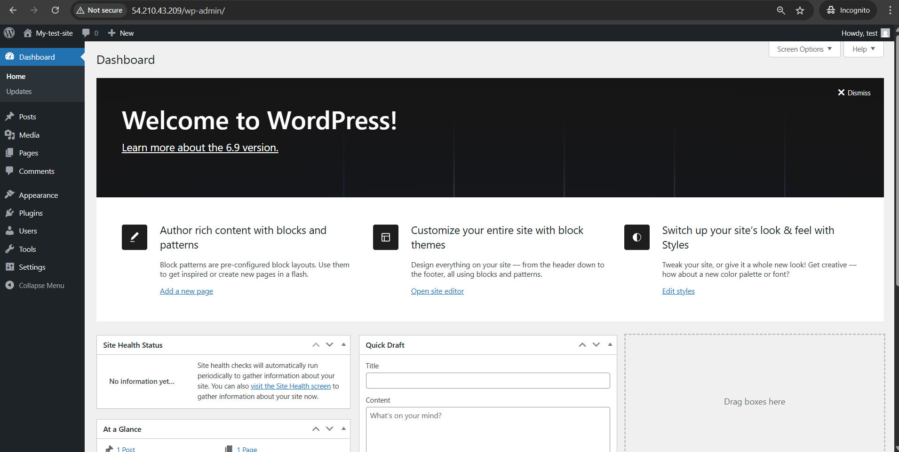 
  
</details>

✅ Verify: After install you can log in:

```text
http://<EC2_PUBLIC_IP>
```
You should see:

* WordPress dashboard
* Homepage with "Hello world!" post

<details> 
<summary>📸 <b>Click to view screenshot</b></summary>
<br>
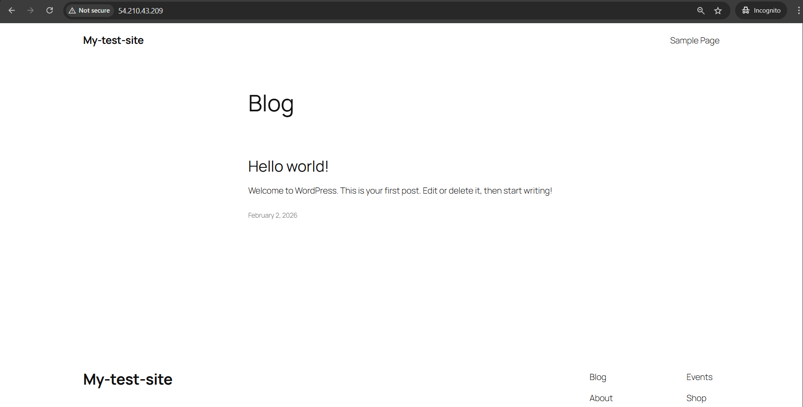
</details>

- Sometimes, we can see the top horizontal bar, and it includes the `Dashboard` option. 
- Browse from a `Private` or use a different `Browser` in that case.
